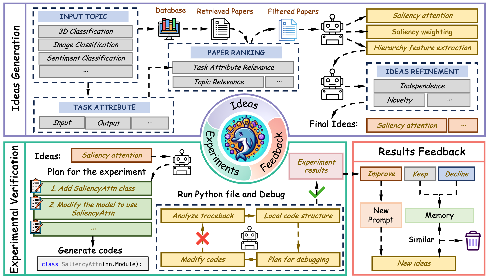

<div align="center">
<h1>Dolphin: Moving Towards Closed-loop Auto-research through Thinking, Practice, and Feedback</h1>

[[ Paper 📓 ]](https://arxiv.org/abs/2501.03916) [[ Project Page 🚀 ]](https://alpha-innovator.github.io/Dolphin-project-page/) 
</div>

# 🔥 News
  - <p style='text-align:justify'><i>2025.04</i>: &nbsp;🎉🎉 We release the paper of <font color="red">Dolphin</font>, a closed-loop LLM-driven framework to enhance the automation level of scientific research </p>

## Introduction

<p align="center">
  
  <!-- <div>The overview of SURVEYFORGE. The framework consists of two main stages: Outline Generation and Content Writing. In the Outline Generation stage, SURVEYFORGE utilizes heuristic learning to generate well-structured outlines by leveraging topic-relevant literature and structural patterns from existing surveys. In the Content Writing stage, a memory-driven Scholar Navigation Agent (SANA) retrieves high-quality literature for each subsection and LLM generates the content of each subsection. Finally, the content is synthesized and refined into a coherent and comprehensive survey.
</div> -->
</p>

Recent works demonstrate that various AI-assisted research methods can largely improve research efficiency by improving data analysis, accelerating computation, and fostering novel ideageneration. To further move towards the ultimate goal (i.e., automatic scientific research), we introduce DOLPHIN, a closed-loop LLM-driven framework to enhance the automation level of scientific research. DOLPHIN first generates novel ideas based on feedback from previous experiments and relevant papers ranked by the topic and task attributes. Then, the generated ideas can be implemented using a code template refined and debugged with
the designed exception-traceback-guided local code structure. Finally, DOLPHIN automatically analyzes the results of each idea and feeds the results back to the next round of idea generation. 

## The usage of Dolphin 🐬

- **Propose novel ideas and implement code automatically**

    | Task | Point Classfication | Image Classification | Sentiment Classification |
    | :---:| :---: | :---: | :---: |
    |Baseline | 91.0% | 81.2% | 91.0%|
    |Dolphin | 93.9% |82.0% | 92.5%|

- **Perform version updates for technologies or code**

    | Task | Code Source | Previous Score| Current Score |
    | :---:| :---: | :---: | :---: |
    |Detecting insults in social commentary | AIDE | 81.0 | 84.7 |
    |Tabular playground series dec 2021 | Kaggle | 95.3 | 96.2|
    |Jigsaw toxic comment classification | Kaggle | 94.7 | 97.2 |


## 🤔 TODO List

- [ ] Release code of Dolphin
- [ ] Support more tasks

## Citations

```
@article{yuan2025dolphin,
  title={Dolphin: Closed-loop Open-ended Auto-research through Thinking, Practice, and Feedback},
  author={Yuan, Jiakang and Yan, Xiangchao and Shi, Botian and Chen, Tao and Ouyang, Wanli and Zhang, Bo and Bai, Lei and Qiao, Yu and Zhou, Bowen},
  journal={arXiv preprint arXiv:2501.03916},
  year={2025}
}

```